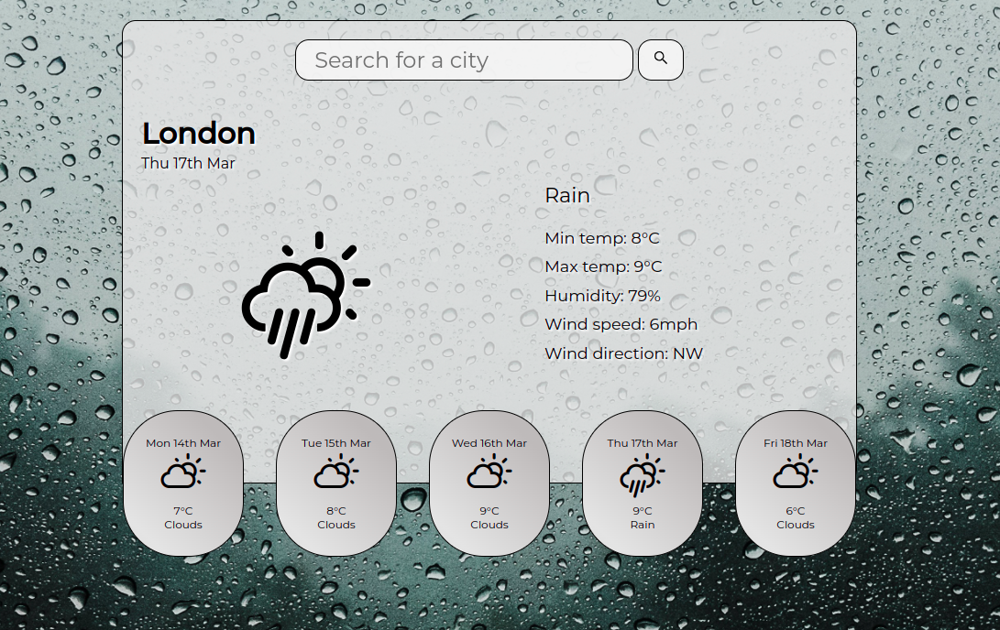

# Weather App

A weather forecast app, created using React.

The app uses the Open Weather API to retrieve and display 5-day weather forecast data for towns and cities in the UK. It includes detailed information such as: min & max temperature, humidity, wind direction and speed as well as a general description and icon depicting the general forecast.

The app was built using the latest React methodologies, using functional components and incorporating hooks, etc. The app is fully responsive, with custom styling for desktop and mobile versions. Features include a background that updates according to the selected weather forecast and forecast summaries that can be expanded to display detailed weather information for a particular day.

During the development process, the app was fully tested using Jest and React Testing Library to write unit tests, following Test-Driven Development (TDD) methodology.

You can see a live deployed version of the app [by clicking here.](https://stupefied-feynman-f27298.netlify.app/)

A Manchester Codes Software Engineering course project.
## Screenshots

## Technologies
* React
* Jest
* React Testing Library
* Third-party API

# Instructions to run app locally
You can either view the live site by clicking here or to run it locally:

Clone this repository into your terminal:
git clone git@github.com:ipek605/weather-app.git

Change directory into the newly created folder and install the project dependencies:
cd tech-test npm install

Start the react app:
npm start

A browser window should automatically open with a live version of the app. If this does not happen, navigate to a new browser window and type bash http://localhost:3000/ into the address bar.
## Status
Project is: _COMPLETE_ 
## Inspiration
Project from the Frontend (React) module of Cyprus Codes Software Engineering FastTrack course. 

## Contact

Created by [@ipek605](https://www.linkedin.com/in/ipek-demirel-soltanov/) - feel free to contact me about the project

